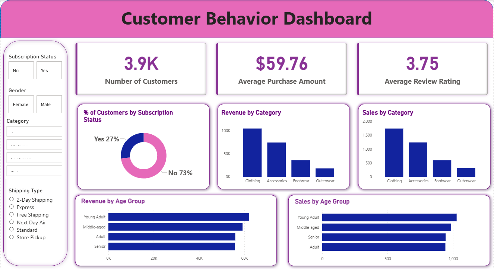
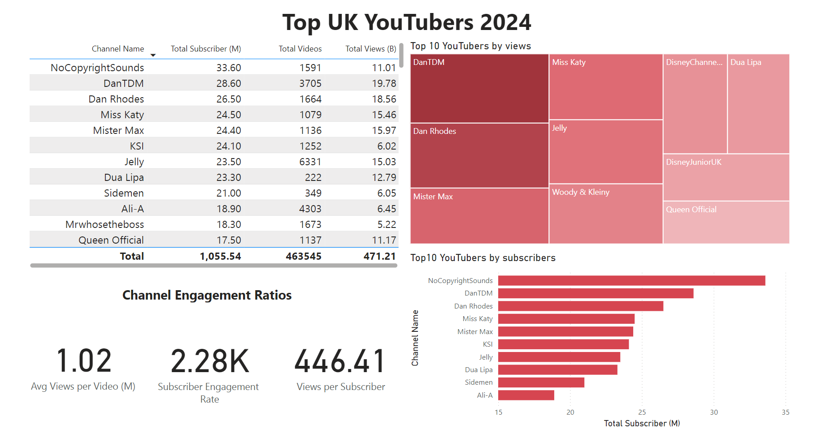

# Data Analytics Portfolio

  <a href="mailto:sayanrupb_ug_22@ei.nits.ac.in">
    
  

---

## About Me

A data-driven and curious engineering student from NIT Silchar with a passion for solving real-world business problems.  
My core expertise lies in building end-to-end data analysis pipelines using Python, SQL, and modern BI tools to transform raw data into actionable insights.  
I also leverage machine learning techniques to enhance predictive capabilities and deliver more robust solutions.  
I am eager to apply my skills in a fast-paced, impact-oriented environment and contribute to data-informed decision-making.

---

### Technical Skills

| Category | Skills |
| :--- | :--- |
| **Languages** | Python, SQL, C, MATLAB |
| **Data Analysis & ML** | Pandas, NumPy, Scikit-learn, TensorFlow, ETL Pipelines, Data Modeling (Star Schema) |
| **Databases** | PostgreSQL, SQL Server |
| **BI & Visualization** | Power BI, Matplotlib, Seaborn |
| **Developer Tools** | Git, GitHub, Jupyter Notebook |
| **Prompt Engineering** | AI-driven problem-solving leveraging tools like Copilot and Claude |

---

## Projects Showcase

Here are some of the projects I've worked on. They demonstrate my ability to handle data from extraction and cleaning to analysis and visualization.

---

### 1. Optimizing Marketing Strategy through Customer Segmentation

  

*   **Description:** An end-to-end analysis of an e-commerce dataset to segment customers, identify purchasing patterns, and provide data-driven marketing recommendations.
*   **Technologies:** Python (Pandas), PostgreSQL, SQL, Power BI
*   **Links:** **[GitHub Repository](https://github.com/SayanrupBarman/customer-behavior-analysis)**

#### Business Problem
An e-commerce business needed to move beyond generic marketing and understand its customer base to drive growth. The key challenge was to extract actionable insights from raw shopping data to identify high-value segments and purchasing patterns.

#### Impact (Result)
The analysis highlighted that male customers generate over double the revenue of female customers, and that spending habits between subscribed and non-subscribed users are nearly identical. This allows the business to refocus marketing on high-revenue demographics and rethink its subscription value proposition.

---

### 2. Maximizing Marketing ROI with Influencer Performance Analysis

  

*   **Description:** An analysis to identify top-performing UK YouTubers for a marketing campaign by enriching a static dataset with live data from the YouTube API.
*   **Technologies:** Python (YouTube API), SQL Server, Power BI
*   **Links:** **[GitHub Repository](https://github.com/SayanrupBarman/youtuber-sponshership-analysis)**

#### Business Problem
The marketing department needed to make a data-driven decision on which top UK YouTubers to partner with. The objective was to identify influencers who would provide the highest potential return on investment (ROI).

#### Impact (Result)
The analysis provided a clear framework for selecting influencers. It demonstrated that for maximum subscriber reach, `NoCopyrightSounds` is the top choice, while for campaigns targeting the highest view count, `DanTDM` is the leader. This enables the marketing team to align their choice of YouTuber with strategic goals.

---

### 3. Building a Scalable Analytics Warehouse for Uber Trip Data

*   **Description:** An end-to-end ETL pipeline to process Uber trip data, model it into a star schema, and load it into a data warehouse for analytics.
*   **Technologies:** Python (Pandas), Google BigQuery, SQL
*   **Links:** **[GitHub Repository](https://github.com/SayanrupBarman/uber-data-engineering-pipeline.git)**

#### Business Problem
To enable business intelligence on Uber trip data, a robust pipeline was needed to process raw data, transform it into a structured format, and load it into a central data warehouse.

#### Impact (Result)
This project successfully built a modern, scalable data engineering pipeline. The resulting star schema in BigQuery allows analysts to easily query key business metrics like average fare amount ($13.25) and average trip distance (3.03 miles), demonstrating a strong understanding of data warehousing principles.

---

### Leadership & Community Involvement

Beyond my technical projects, I am actively involved in various leadership and community roles that have honed my collaboration, communication, and event management skills.

*   **Treasurer, INSEES NIT Silchar:** Managed budgeting, sponsorship outreach, and stakeholder relations, overseeing funds to support academic and student initiatives.
*   **Community Manager, BACE NIT Silchar:** Led community operations and engagement, ensuring a constructive environment and smooth content flow for members.
*   **Event Coordination:** As a head at Illuminits & Symphonits and an event coordinator for college fests like Tecnoesis, I have experience in coordinating events, managing logistics, and providing creative support.
*   **Volunteer & Interests:** I am a volunteer for the Eco Club and enjoy creative pursuits like art and guitar, reflecting my passion for teamwork and continuous learning.

---

### Resume & Contact

*   **[Download My Resume](https://drive.google.com/file/d/1ojOCLSvwuZW5dR2vqM5KAj3JzBYGPRTk/view?usp=sharing)**
*   **Email:** sayanrupb_ug_22@ei.nits.ac.in
*   **Contact:** 9706012592
*   **GitHub:** [SayanrupBarman](https://github.com/SayanrupBarman)
